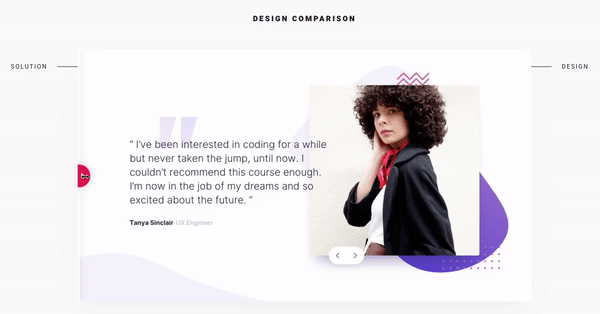

# [Frontend Mentor](https://www.frontendmentor.io) - Coding Bootcamp Testimonials Slider

## Solution preview

_Solution preview by [Frontend Mentor](https://www.frontendmentor.io/solutions/mobilefirst-with-flexbox-and-oldfashioned-css-2woK6yE1s)_

## The challenge

The challenge is to build out this testimonial slider and get it looking as close to the design as possible.

- The mobile and desktop version of the design are in JPG static format, meaning best judgment is required for styles such as `font-size`, `padding` and `margin`.
- Optimized assets are provided in the `/images` folder.
- There is also a `style-guide.md` file, which contains the information such as color palette and fonts.

User Stories:

- View the optimal layout for the component depending on their device's screen size
- Navigate the slider using either their mouse/trackpad or keyboard

## Tools

- SCSS, BEM, Flexbox, [Perfect Pixel](https://www.welldonecode.com/perfectpixel)
